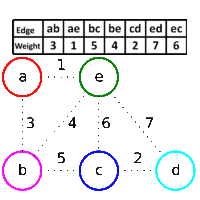

#PAA
#Professor Fabrício

### Arvore geradora mínima (Minimum Spanning Tree)

Uma árvore geradora (= spanning tree) de um grafo G é uma arvore cujas
arestas ligam todos os vertices de G.

Uma árvore geradora mínima é a arvore geradora cuja soma dos
pesos dos vertices tem o menor valor possível.

O algoritmo para gerar uma árvore geradora mínima é o Kruskal.

Uma árvore geradora mínima ótima é formada por sub-árvores ótimas.  
Ou seja tem sub-estrutura ótima.

### Algoritmo do Kruskal:

Crie conjuntos de vertices que são sub-árvores mínimas.  
Cada sub-árvore começa com um único vertice de forma que a princípio
cada vertice representa uma sub-árvore distinta.  
Escolha a menor aresta possível no grafo que não gere ciclo
e faça a união das duas árvores que ele liga.  
Repita a escolha de aresta até obter uma única sub-árvore.  
fim.

Uma demonstração retirada da wikipedia em inglês:



```javascript
def Kruskal(G):
  sets = []
  for v in G.V:
    # Make a list with one element:
    newSet = [v]
    # Add it to the sets list:
    sets[v.id] = newSet

  edges = G.E

  edges.sortByWeight()
  
  var min = {value: null, item: null};

  tree = []
  for (u, v) in edges:
    if sets[u.id] != sets[v.id]:
      # Add this edge to the tree:
      tree.append((u, v))
      
      # Join both sets into one:
      sets[v.id].extend(sets[u.id])
      sets[u.id] = sets[v.id]
```

Complexidade: O(E lg V)

### Algoritmo de Prim:

O algoritmo PRIM pode ser descrito em 3 etapas:

1. Escolha um nó e use ele como raiz da árvore T.
2. Dos vertices que ligam um membro da árvore a um nó ainda não pertencente a árvore escolha o menor e adicione a árvore.
3. Repita o passo 2 até todos os nós estarem na árvore.

O algoritmo abaixo não é o mesmo que o professor apresentou na aula, mas é bem mais simples de entender.

```python
def PRIM(G, root):
  tree = [ root ]
  treeEdges = []
  freeEdges = root.edges
  
  while len(tree) < len(G.V):
    # Get the smallest edge from freeEdges:
    (orig, dest, cost) = extractMinEdge( freeEdges )
    
    # Update the tree info:
    tree.append(dest)
    treeEdges.append( (orig, dest, cost) )
    
    # Update the freeEdges list:
    for e in dest.edges:
      if e.dest not in tree:
        freeEdges.append( e )
```

A complexidade do Prim pode ser dada segundo a tabela:

| Tipo de Armazenamento | Complexidade |
| --------------------- | ------------ |
| Array                 | O(V²)        |
| Binary Heap           | O(E log(V))  |
| Fib Heap              | O(E+V log(V) |


