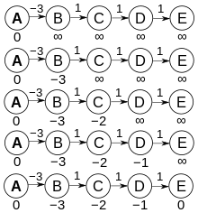

#PAA
#Professor Fabrício

## Single-Source Shortest Path

Seja um grafo direcionado com pesos. Encontre o
menor caminho (menor peso) do vertice S para o V.

### Shortest Path Properties

1. Optimal substructure:
   O melhor caminho ótimo é composto de subcaminhos ótimos.

2. O menor caminho satisfaz a inegualdade de triangulo:  
   Se tenho o caminho mínimo de (a,b) ele deve ser <=
   a soma do caminho mínimo de (a,c) + (c,b) para um vertice c qualquer.

### Grafos com pesos negativos:

Grafos com pesos negativos podem causar problemas. Se houver um ciclo
cujo peso total é negativo, isso significa que caminhar 2 vezes pelo
ciclo é `mais perto` do que caminhar uma vez. Assim em grafos
onde haja ciclos negativos não é possível obter o caminho mínimo.

Por outro lado se não houverem ciclos negativos não há problema
em haverem pesos negativos nas arestas.

### Relaxamento:
 
  A idéia do relaxamento consiste em armazenar o caminho
  (a,b) = infinito a princípio e para cada novo caminho
  melhor que o anterior reduzir esse caminho. Para isso
  basta fazer o teste:
  
```python
  # d = distancia da origem
  # w = peso da aresta
  if d[b] >= d[c] + w(c,d):
    d[b] = d[c] + w(c,b)
```

### Algoritmos:

#### Dijkstra:

Este algoritmo utiliza dois conjuntos de nós:

- Visitados
- Não visitados

Todos os nós começam com a distancia para a raiz = infinito,
com exceção do nó raiz cuja distancia é 0.

A cada iteração o algoritmo escolhe do conjunto de nós não visitados
o nó mais próximo da raiz `P` e então para cada vizinho de `P`
calcula a distância à raiz considerando um caminho que passe por `P`.

Se o caminho encontrado for melhor que o caminho encontrado
anteriormente o caminho antigo é substituido.

`P` é então adicionado ao conjunto de nós visitados e o algoritmo
continua para a próxima iteração.

O algoritmo pára quando não houverem mais nós a serem visitados.


```python
def Dijkstra(G, root):
  # Distance list:
  d = []
  # Ancestor list:
  a = []
  
  for v in G.V:
    # Set the distance to infinity:
    d[v] = <infinity>
    # Set the ancestor to None:
    a[v] = None

  # The root vertex start with distance 0:
  d[root] = 0
  
  # Copy the vertex list:
  nodes = G.V
  nodes.remove(root)
  
  while len(nodes) > 0:
    v = nodes.extractCloserNode()
    
    # Update the distances to all
    # nodes adjacent to v:
    for u in v.adjacents():
      if d[u] > d[v] + w(v,u):
        d[u] = d[v] + w(v,u)
        a[u] = v
```

Complexidade no tempo:

- O( E log(V) ) com heap binário.
- O( V log(V) + E ) com heap de fibonacci.

Se o grafo não tiver pesos nas arestas voce pode utilizar
**Busca em Largura (BFS)** para encontrar a menor distancia
com complexidade: O(V+E)

#### Bellman-Ford:

O Bellman-Ford tem uma vantagem sobre o Dikstra:
  ele detecta ciclos negativos.

O algoritmo é menos eficiente, porém mais seguro.  
A idéia do algoritmo consiste em relaxar todos as E
arestas V-1 vezes onde V é o número de vertices, ou seja
O(V * E) relaxamentos. Esse é o número de iterações que garante
que todas as distancias já foram calculadas, e todas já estão
no mínimo mesmo no pior caso para um grafo sem ciclos negativos.

Após isto o algoritmo executa mais uma vez o relaxamento para cada aresta
se ainda houver uma forma de melhorar algum caminho mínimo significa
que há ao menos um ciclo negativo no grafo.

A figura abaixo apresenta um grafo degenerado (o pior caso nesse problema), neste
exemplo `len(V) = 5` e  logo o número de loops do algoritmo será `V-1 = 4`.
Note que após 4 iterações mesmo nesse pior caso todos as arestas já terão encontrado
o melhor caminho:



```python
BellmanFord(G, root)
  # Distance list:
  d = []
  # Ancestor list:
  a = []
  for v in G.V
    d[v] = infinito
    a[v] = None
  
  # Root distance to root is 0:
  d[root] = 0
  
  # Run once for each node of G -1:
  for i from 1 to len(G.V)-1:
    # Run once for each edge of G: (run G.V * G.E times)
    for edge (u,v) in G.E:
      if(d[v] > d[u] + w(u,v))
        d[v] = d[u] + w(u,v)
        a[v] = u

  # Run again, if there is a better path
  # it means we have a negative cicle:
  for edge(u,v) in G.E:
    if(d[v] > d[u] + w(u,v)):
      return 'No solution!'
```

Complexidade no tempo: O(V * E)

---

# Fim da Aula!
